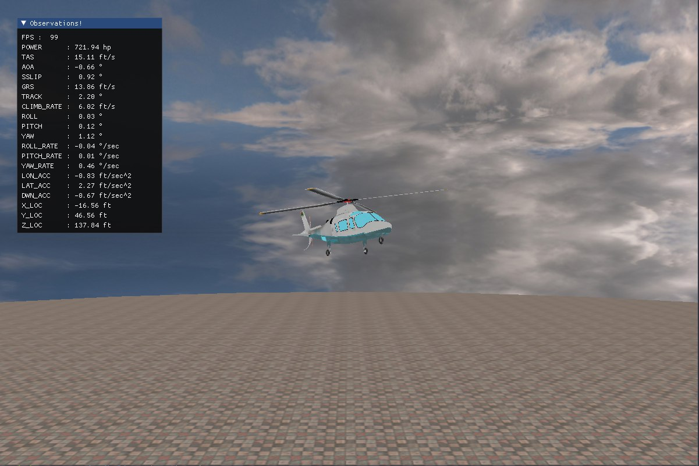

# heli-gym 🚁
OpenAI GYM environment for 6-DOF Helicopter simulation.

This is GYM environment package for reinforcement learning for helicopter flight tasks using minimum complexity helicopter model.

## Environment Details

* Pure Gym environment
* Realistic Dynamic Model based on Minimum Complexity Helicopter Model ([Heffley and Mnich](https://robertheffley.com/docs/Sim_modeling/Heffley-Mnich--Minimum-Complexity%20Helicopter%20Simulation%20Math%20Model--NASA%20CR%20177476.pdf))
In addition, inflow dynamics are added and model is adjusted so that it covers multiple flight conditions. 
* Rendering is done by OpenGL.



### Action Space
| Num | Act                | Unit  | Min   | Max    |
|-----|--------------------|-------|-------|--------|
| 0   | Collective         |       | -1    | 1      |
| 1   | Lon. Cyclic        |       | -1    | 1      |
| 2   | Lat. Cyclic        |       | -1    | 1      |
| 3   | Pedal              |       | -1    | 1      |

### Observation Space
| Num | Obs                | Unit  | Min   | Max    |
|-----|--------------------|-------|-------|--------|
| 0   | power              | hp    | 0     | ∞      |
| 1   | air speed          | ft/s  | 0     | ∞      |  
| 2   | angle of attack    | deg   | -180  | 180    |
| 3   | sideslip angle     | deg   | -180  | 180    |
| 4   | ground speed       | ft/s  | 0     | ∞      |  
| 5   | track angle        | deg   | -180  | 180    |
| 6   | climb rate         | ft/s  | -∞    | ∞      |  
| 7   | roll angle         | deg   | -180  | 180    |
| 8   | pitch angle        | deg   | -180  | 180    |
| 9   | yaw angle          | deg   | -180  | 180    |
| 10  | roll rate          | deg/s | -∞    | ∞      |  
| 11  | pitch rate         | deg/s | -∞    | ∞      |  
| 12  | yaw rate           | deg/s | -∞    | ∞      |  
| 13  | x acc (body)       | ft/s^2| -∞    | ∞      |  
| 14  | y acc (body)       | ft/s^2| -∞    | ∞      |  
| 15  | z acc (body)       | ft/s^2| -∞    | ∞      |  
| 16  | x loc (earth)      | ft    | -∞    | ∞      |  
| 17  | y loc (earth)      | ft    | -∞    | ∞      |  
| 18  | z loc (earth)      | ft    | -∞    | ∞      |

## Tasks
For now only one task is available. 

| Environment        | Details              |
|--------------------|----------------------|
| HeliHover-v0       | Hovering Task        |

## Setup
Run following command.
```bash
pip install -e .
```

## Usage
Create environment by either,
```python
from heligym import HeliHover
env = HeliHover()
```
or
```python
import gym
import heligym
env = gym.make("HeliHover-v0")
```

The rest is usual as of any GYM environment !
